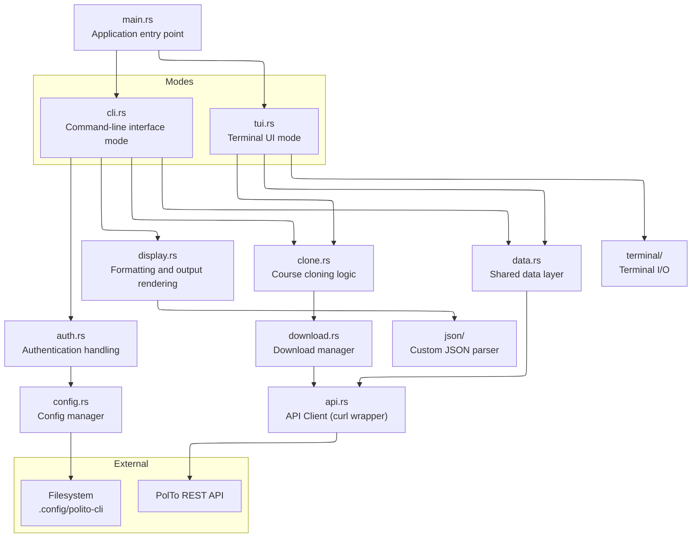

# polito-cli

CLI + TUI tool for PoliTo students to browse and download course materials via the official API.
Zero external crate dependencies.

You can find the openapi spec [here](https://github.com/polito/api-spec/blob/master/dist/clients/student/openapi.yaml).

## Installation

You can manually install from [releases](https://github.com/Jarmoco/polito-cli/releases) or use [Homebrew](https://brew.sh/) (Linux and MacOS only):

```bash
brew tap Jarmoco/polito-cli
brew install polito-cli
```

One-liner:

```bash
brew install jarmoco/polito-cli/polito-cli
```

## Quick start

```bash
polito login
polito courses
polito          # interactive TUI
```
Testing again a mock api is also supported, check the [USAGE.md](USAGE.md#testing-with-mock-server) mock testing section for more information.


## Building

Ensure you have fetched submodules first:
```bash
git submodule update --init --recursive
```


All build dependencies will be automatically installed (and then uninstalled) by the build script, just run:

```bash
./rcc-scripts/build.sh
```

More info about rcc-scripts [here](https://github.com/Jarmoco/rcc-scripts).

Packages will be available in the `dist/` directory.


## Architecture
A high-level overview of the architecture:


## Design

- **Zero external crates** — only the Rust standard library
- **HTTP** via `std::process::Command` calling `curl`
- **JSON** via custom recursive-descent parser in `src/json/`
- **TUI** built from scratch with in-memory screen buffer and escape code rendering
- **Shared data layer** (`data.rs`) eliminates duplicated fetch+parse across CLI and TUI

## Project Structure

```
src/
├── main.rs             Entry: no args → TUI, args → CLI dispatcher
├── cli.rs              Manual CLI argument parser
├── error.rs            PoliError enum
├── config.rs           XDG token / user file storage
├── data.rs             Shared data access (fetch courses, files, exams, etc.)
├── api.rs              curl subprocess wrappers with auth
├── auth.rs             Login, logout, whoami handlers
├── download.rs         Single & bulk file download
├── clone.rs            Course clone orchestrator
├── conflict.rs         Conflict detection for clone
├── meta.rs             Clone metadata I/O
├── json/               Custom JSON parser & value type
│   ├── mod.rs
│   ├── parser.rs       Recursive-descent parser
│   └── value.rs        JSON value enum (display, indexing, construction)
├── terminal/           Raw TTY input (cross-platform)
│   ├── mod.rs          Dispatch to platform-specific getch
│   ├── linux.rs        termios-based getch
│   ├── macos.rs        macOS cfgetospeed path
│   ├── windows.rs      SetConsoleMode-based getch
│   └── signal.rs       SIGWINCH / SIGINT handlers
├── display/            CLI output rendering
│   ├── mod.rs          Module re-exports
│   ├── color.rs        ANSI escape sequence helpers
│   ├── courses.rs
│   ├── files.rs
│   ├── notices.rs
│   ├── exams.rs
│   ├── lectures.rs
│   └── grades.rs
├── tui/                Interactive TUI screens
│   ├── mod.rs          Screen dispatch
│   ├── menu.rs         Main menu
│   ├── courses.rs
│   ├── files.rs
│   ├── notices.rs
│   ├── exams.rs
│   ├── lectures.rs
│   ├── grades.rs
│   └── clone/          Clone course screens
│       ├── mod.rs      Course selection + confirmation
│       ├── select.rs   File selection with checkboxes
│       └── run.rs      Download execution + progress
└── util/               Shared helpers
    ├── mod.rs          Re-exports, file flattening, tree walk
    ├── date.rs         Week bounds, epoch conversion, timestamp
    ├── html.rs         HTML/ANSI tag stripping
    ├── string.rs       String truncation
    └── fs.rs           File open & directory picker
```

## Modes

| Invocation | Mode | Behavior |
|---|---|---|
| `polito` | TUI | Interactive terminal UI |
| `polito <command>` | CLI | One-shot command, table output |
| `polito <command> --json` | CLI | One-shot command, JSON output |

See [USAGE.md](USAGE.md) for full command reference, TUI key bindings, configuration, and testing guide.
